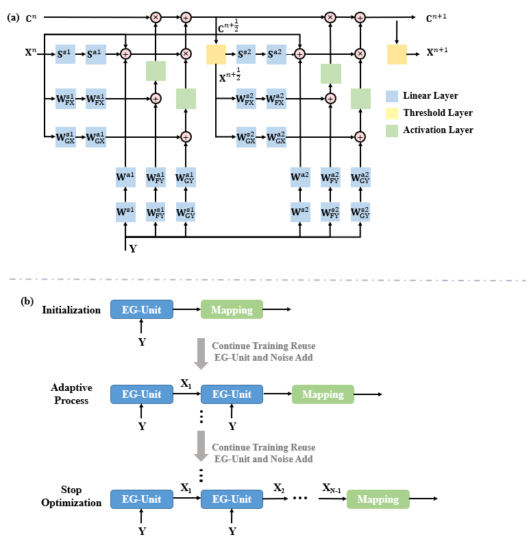

# AEME

## TODO

- [ ] AEME+ Pretrained model
- [ ] AEME+ Finetune code

## Milestone
- The original MICCAI paper AEME was accepted for MICCAI 2022.

- The vanilla version won the best performance in the MICCAI-Quad22 challenge among end-to-end networks (Signal to Metrics).

## Introduction
<p align="center">
   
</p>
<p align="center"> Fig.1 The overall structure of two fitting methods. <p align="center">

This repository provides a demonstration of a space acceleration network for the dMRI model, AEME/AEME+. This universal network is not restricted to specific models. You can further train the model on your own dataset. The project was originally developed for our previous work, AEME/AEME+, and can be used directly or fine-tuned with your dataset.

## Requirements

Before you can use this package for image segmentation. You should install the follwing libary at least:
- PyTorch version >=1.8
- Some common python packages such as Numpy, H5py, NiBabel ...

## Quick Preview
A code snippet of the noise-tuning module is shown below. 

### Noise-tuning
```python
def noiseadd(model, noise_lambda):
    # Set the same random seed across all GPUs
    torch.manual_seed(int(time.time()))
    # Ensure the random seed is synchronized across GPUs
    if torch.cuda.is_available():
        torch.cuda.manual_seed_all(int(time.time()))

    for name, para in model.named_parameters():
        # Generate noise on CPU first to ensure it's the same across GPUs
        noise = torch.randn(para.size(), device='cpu') * (noise_lambda * torch.std(para.cpu()))
        # Move noise to the same device as parameter
        noise = noise.to(para.device)
        # Broadcast the noise from rank 0 to ensure all GPUs have the same noise
        torch.distributed.broadcast(noise, src=0)
        # Add noise to parameters
        para.data.add_(noise)
```

## Citation

If you find it useful for your research, please consider citing the following sources:

Original MICCAI version, first adopted the extragradient method in the qMRI / microstructure estimation area

```
@inproceedings{zheng2022adaptive,
  title={An adaptive network with extragradient for diffusion MRI-based microstructure estimation},
  author={Zheng, Tianshu and Zheng, Weihao and Sun, Yi and Zhang, Yi and Ye, Chuyang and Wu, Dan},
  booktitle={International Conference on Medical Image Computing and Computer-Assisted Intervention},
  pages={153--162},
  year={2022},
  organization={Springer}
}
```


## Acknowledge and Statement

- This project was designed for academic research, not for clinical or commercial use, as it's a protected patent.
  
- If you have any questions, please feel free to contact [me](mailto:zhengtianshu996@gamil.com).
